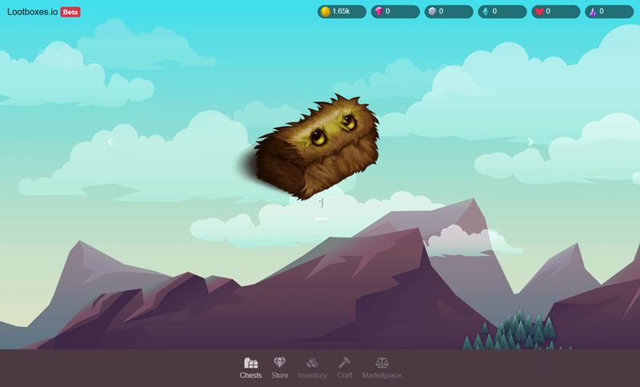

# lootboxes

Surprise mechanics based game designed to provide players with a sense of pride and accomplishment for unlocking different things.
Of course, and even if it's a parodic game, you can pre-order an early access to the open beta [now](https://dropsnorz.github.io/lootboxes).

## Overview



## Contributing

```bash
# Install project dependencies
npm install

# Serve vue app with hot reload at localhost:8080
npm run serve
```

Feel free to add more gambling stuff like slot machines, wheel of fortunes, etc... to ensure that players have challenges that are compelling and rewarding.
Here is a list of things to implement.

### Features Ideas
* Local storage (Save player progression)
* Settings Menu (Reset progression, game options)
* More complex rewards and currency usage (idle game reward curve)
* Preload assets (+ use spritesheets instead of multiple images)

### Game modes Ideas
* Slot machines
* Wheel of fortune
* Gacha mechanics
* Timer / idle gameplays (Wait for rewards)
* Premium mode with higher loot rates
* Currencies exchange market

## Credits

* Fluffy Trease Chest (by [Jaqueline Martin](https://www.patreon.com/darkparadigmgames))
* Items icons (by [Ravenmore](http://dycha.net/))
* Various assets by [Craftpix](https://craftpix.net/)

## References

* [EA - Theory of accomplishment-dirven gameplay patterns](https://www.reddit.com/r/StarWarsBattlefront/comments/7cff0b/seriously_i_paid_80_to_have_vader_locked/dppum98/)
* [EA - Applying kinder eggs strategy to video games](https://www.youtube.com/watch?v=nVYEqaFZJWo)
* [2K - How to introduce fun in a basketball video game](https://www.youtube.com/watch?v=46MQ1ZMZ-l4)
